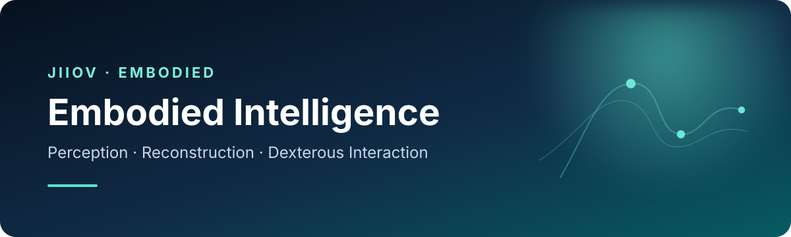

  

  <strong>Building the data, perception, and learning foundations for embodied intelligence.</strong> 
  构建具身智能的数据、感知与学习基础。

  <a href="https://simplehand.github.io/">SimpleHand</a> ·
  <a href="https://arxiv.org/abs/2403.01813">Paper</a> ·
  <a href="https://github.com/patienceFromZhou/simpleHand">Code</a> ·
  <a href="https://en.jiiov.com/">JIIOV Technology</a>

---

### What we work on · 研究方向

We develop practical perception and interaction systems that connect **AI with real-world sensors and devices**. Our work spans:

- **3D hand perception** — pose estimation, mesh reconstruction, and tracking
- **Dexterous interaction** — robust understanding of fine-grained finger motion
- **Efficient models** — accurate, real-time inference for edge and XR devices
- **Embodied data** — datasets, evaluation, and learning systems grounded in the physical world

我们致力于连接 **AI、传感器与真实世界设备**，重点关注三维手部感知、灵巧交互、端侧高效模型与具身数据系统。

### Featured work · 代表工作

#### [SimpleHand](https://simplehand.github.io/) — A Simple Baseline for Efficient Hand Mesh Reconstruction

**CVPR 2024** · [Paper](https://arxiv.org/abs/2403.01813) · [Code](https://github.com/patienceFromZhou/simpleHand)

SimpleHand is a simple and effective baseline for monocular 3D hand mesh reconstruction. It combines a lightweight token generator with a cascaded mesh regressor, achieving a strong balance between accuracy and real-time efficiency—and is designed to transfer easily across mainstream backbones and datasets.

SimpleHand 是一个面向单目三维手部网格重建的简洁高效基线，通过轻量的 token generator 与级联 mesh regressor，在精度和实时效率之间取得良好平衡，并可方便迁移至主流骨干网络与数据集。

  

### Highlights · 研究成果

- **CVPR 2024** — SimpleHand accepted as *A Simple Baseline for Efficient Hand Mesh Reconstruction*
- **1st place, ICCV 2023 Hands Workshop** — AssemblyHands Track for egocentric 3D hand joint reconstruction · [Technical report](https://arxiv.org/abs/2310.04769)
- **1st place, ECCV 2024 Hands Workshop** — Hand pose estimation and hand shape estimation tracks for multiview egocentric hand tracking · [Technical report](https://arxiv.org/abs/2409.19362)

### Open source · 开源计划

This organization is the new open-source home for JIIOV's embodied-intelligence work. We are organizing prior research and preparing more datasets, models, demos, and engineering tools for release.

这里将作为极豪科技具身智能方向的开源主页。我们正在整理既有研究成果，并将逐步发布更多数据集、模型、演示与工程工具。

  Research should be rigorous. Systems should be useful. Interaction should feel natural.

